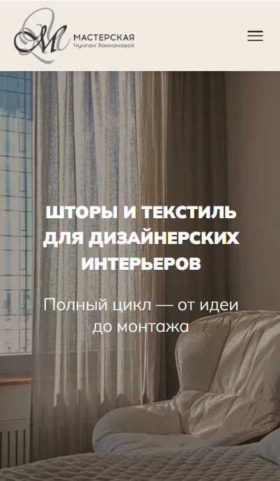
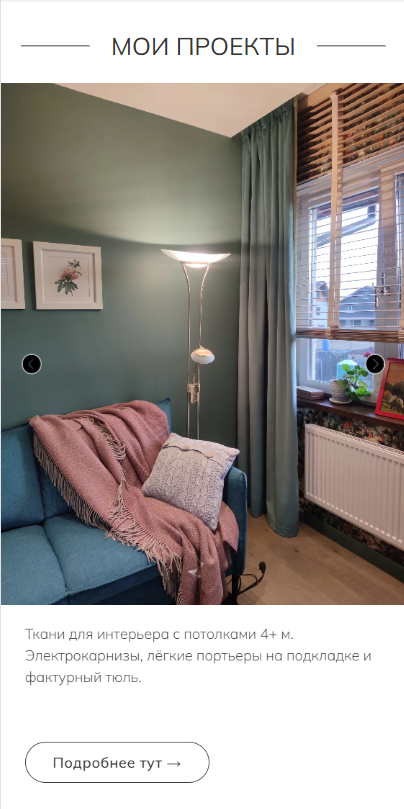

# Business Card Website 🌐

Персональный сайт-визитка, разработанный на заказ. Современный адаптивный лендинг с каталогом услуг и галереей работ.

## 📋 Описание

Одностраничный сайт с дополнительной навигацией, созданный для презентации услуг и портфолио. Проект включает адаптивную вёрстку для корректного отображения на всех устройствах.

## ✨ Особенности

- **Адаптивный дизайн** — корректная работа на мобильных, планшетах и десктопах
- **6 страниц**: главная + 5 дополнительных разделов
- **Фотогалерея** — кастомная карусель с плавной навигацией
- **Оптимизированная вёрстка** — быстрая загрузка и SEO-friendly структура

## 📄 Структура сайта

1. **Главная страница** — основная информация
2. **Текстильное оформление** — соответветсвующая названию информация
3. **Мягкая мебель и панели** — соответветсвующая названию информация
4. **Комплектация интерьера** — соответветсвующая названию информация
5. **Обо мне** — информация о владельце сайта
6. **Мои проекты** — Список закрытых кейсов

##  Технологии

- **HTML5** — семантическая разметка
- **CSS3** — стилизация, анимации, медиа-запросы
- **JavaScript** — интерактивность, карусель
- **GitHub Pages** — хостинг

## 🚀 Демо

Сайт доступен по ссылке: https://hannanova.ru/

## 📸 Скриншоты

### Десктопная версия


### Мобильная версия


### Карусель


## 📦 Установка и запуск локально

1. Клонируйте репозиторий:
```bash git clone https://github.com/thebucagod/Business-card-website.git ```

## ⚖️ Права

© 2024 Вадим. Все права защищены.

Проект создан на заказ. Код предоставлен в портфолио 
исключительно для демонстрации навыков. 
Запрещается копирование и использование без разрешения.